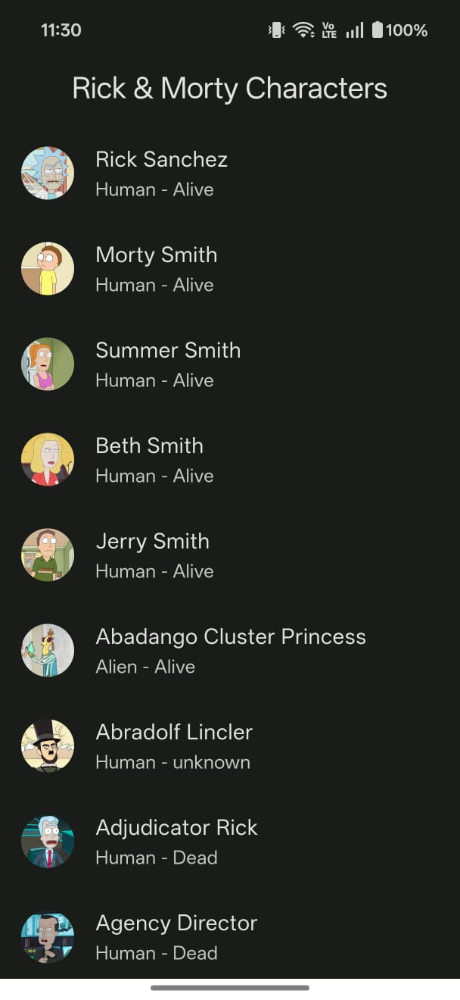
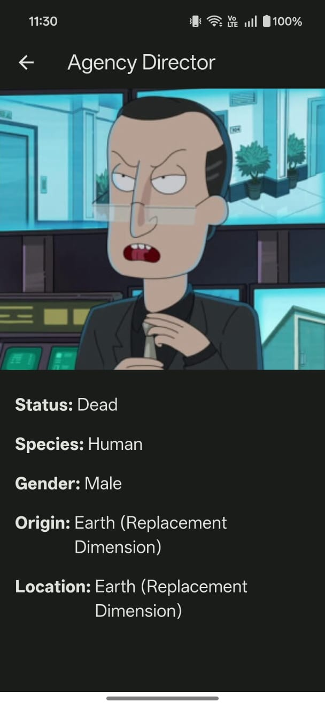

# Rick & Morty Characters Explorer

A Flutter application that displays characters from the  
[Rick and Morty API](https://rickandmortyapi.com/) using a clean and scalable
architecture. The app supports offline access, smooth pagination, and a
modern Material 3 user interface.

---

## Screenshots

<p align="center">
  
  
  
  
</p>

---

## Features

- **Clean Architecture** with clear separation of Domain, Data, and Presentation layers
- **Offline Support** using Isar Database for local caching
- **Infinite Pagination** with smooth scrolling and proper state handling
- **State Management** using Riverpod for reactive and predictable UI updates
- **Modern UI** built with Material 3, Hero animations, and cached images

---

## Tech Stack

- **Flutter & Dart** – Cross-platform UI development
- **Riverpod** – State management and dependency injection
- **Dio** – API networking
- **Isar** – High-performance local database
- **Freezed & build_runner** – Immutable models and code generation

---

## Architecture Overview

The project follows **Clean Architecture** principles to ensure scalability
and maintainability.

- **Domain Layer**  
  Contains business logic, entities (e.g. `Character`), and repository interfaces.

- **Data Layer**  
  Responsible for fetching data from the network and local storage using
  Dio and Isar. Implements repository logic and caching strategies.

- **Presentation Layer**  
  Contains Flutter UI screens and Riverpod providers to manage UI state,
  pagination, loading, and error handling.

---

## Caching & Pagination Strategy

- Uses a **cache-first approach** to display stored data quickly
- Fetches fresh data from the API and updates the local cache
- Preserves existing data if a pagination request fails, ensuring a smooth UX

---

## Setup

### Prerequisites

- Flutter SDK (latest stable)
- Android Studio or VS Code
- Emulator or physical device

### Run the Project

```bash
flutter pub get
dart run build_runner build --delete-conflicting-outputs
flutter run
```
